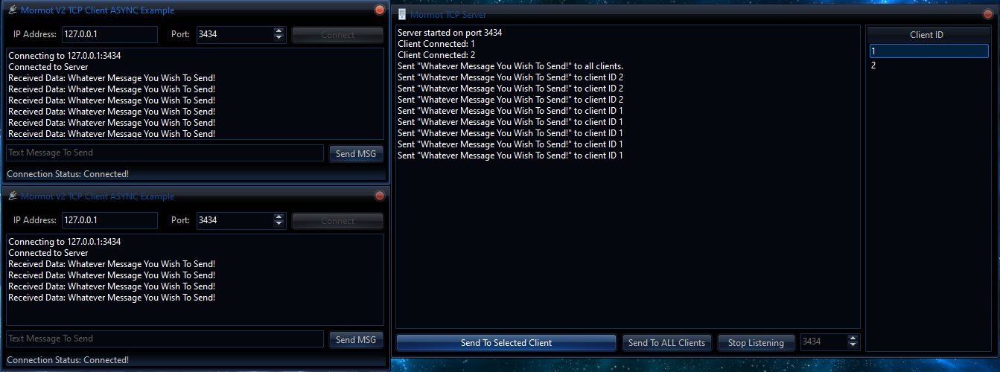

</head>
<body>
    <h1>🔄 Delphi mORMot Sockets (Asynchronous Server)</h1>
    

        A Delphi VCL application that creates an asynchronous server using the <strong>mORMot</strong> library. 
        This server can manage multiple client connections, send messages, and dynamically update the client list.
    

  

    <h2>📋 Features</h2>
    <ul>
        <li><strong>Asynchronous Server</strong>: Implements a non-blocking server using <code>mormot.net.async</code> and <code>mormot.net.sock</code>.</li>
        <li><strong>Messaging</strong>: Supports sending messages to a specific client or broadcasting to all connected clients.</li>
        <li><strong>Client Management</strong>: Displays connected clients in a <code>TListView</code> and logs server activities in a <code>TMemo</code>.</li>
        <li><strong>Automatic Client Updates</strong>: Dynamically adds or removes clients from the list upon connection or disconnection.</li>
    </ul>
    <h2>🔍 Overview</h2>
    <ul>
        <li><code>Button1Click</code>: Starts or stops the asynchronous server on a specified port.</li>
        <li><code>SendToSelectedClient</code>: Sends a custom message to a specific client ID.</li>
        <li><code>SendToAllClients</code>: Broadcasts a custom message to all clients.</li>
        <li><code>LogMessage</code>: Displays server logs and events in the <code>TMemo</code>.</li>
        <li><code>TConnection</code>: Handles client connections, data reading, and connection events.</li>
    </ul>
    <h2>🛠️ Requirements</h2>
    <ul>
        <li><strong>Delphi RAD Studio</strong>: IDE with VCL support.</li>
        <li><strong>mORMot V2 Library</strong>: Download from <a href="https://github.com/synopse/mORMot2" target="_blank">GitHub</a>.</li>
    </ul>
    <h2>📜 License</h2>
    

        This project is provided as freeware. Use at your own risk for research purposes.
    

    <h2>📧 Contact</h2>
    

        <strong>Discord</strong>: BitmasterXor
    

    
Developed with ❤️ by <strong>BitmasterXor</strong>, using Delphi RAD Studio.

